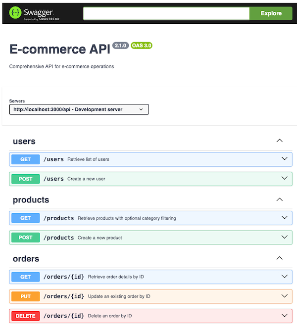

# Documentry

[](https://www.npmjs.com/package/documentry)
[](https://opensource.org/licenses/MIT)

Documentry is a AI-powered Typescript library that uses LLM models to understand your Next.js API routes and
automatically generate detailed OpenAPI documentation in multiple formats: `json`, `yaml`, and interactive `html`.

With a single terminal command, `Documentry` scans every API route in your Next.js project,
understand the actual code of your `route.ts` files, and generates a valid `OpenAPI Specification (OAS)` file that
describes your endpoints.

## Key Features

- 🚀 Automatically scams your project and detects your Next.js API routes
- 🧠 Uses AI to understand the actual code of your routes
- 📝 Creates `OpenAPI 3.0` specifications in `json`, `yaml`, or interactive `html` format
- 🔄 Currently supports OpenAI and Anthropic models

## Installation

```bash
npm install documentry --save-dev
```

## Usage

### Command line

```bash
npx documentry 
```

### Programmatic API

```typescript
import { Documentry } from 'documentry'

// Create a new Documentry instance
const documentry = new Documentry()

// Generate OpenAPI specs
await documentry.generate()
```

<details>
<summary>Full usage example</summary>

```typescript
const documentry = new Documentry({
  provider: 'anthropic',
  model: 'claude-3-5-sonnet-latest',
  apiKey: process.env.LLM_PROVIDER_API_KEY,
  dir: './app/api',
  routes: ['/user', '/products/*'],
  outputFile: './docs/openapi',
  format: 'html', // 'yaml', 'json', or 'html'
  info: {
    title: 'My API',
    version: '1.0.0',
    description: 'My API description'
  },
  servers: [
    {
      url: 'http://localhost:3000/api',
      description: 'Local server'
    },
    {
      url: 'https://api.example.com',
      description: 'Production server'
    }
  ]
})

await documentry.generate()
```

An example of the generated OpenAPI documentation in HTML format:




</details>


More examples can be found in the [examples](src/examples) directory.

## Environment variables

You can configure the LLM settings with an `.env` file:

```bash
export LLM_PROVIDER=your-llm-provider # openai or anthropic; defaults to anthropic
export LLM_MODEL=your-llm-model # defaults to claude-3-5-sonnet-latest
export LLM_PROVIDER_API_KEY=your-api-key
```

## Configuration Options

The CLI usage supports the following options:

| Flag                              | Description                                                                   | Default                                     |
|-----------------------------------|-------------------------------------------------------------------------------|---------------------------------------------|
| `--dir <directory>`               | Root directory for your Nextjs API routes (`./app/api`, `./src/app/api`, etc) | `./app/api`                                 |
| `--routes <routes>`               | List of routes to process (e.g., "/user,/products/*")                         | All routes are considered                   |
| `--servers <servers>`             | List of server URLs (e.g. "url1\|description1, url2...")                      | URL: `http://localhost:3000/api`            |
| `-o, --output-file <file>`        | Output folder/file for the generated OpenAPI specs                            | `./docs/openapi`                            |
| `-f, --format`                    | The format for the generated OpenAPI file (`yaml`, `json`, or `html`)         | `yaml`                                      |
| `-t, --title <title>`             | Title for the OpenAPI spec                                                    | `Next.js API`                               |
| `-d, --description <description>` | Description for the OpenAPI spec                                              | `API documentation for Next.js routes`      |
| `-v, --version <version>`         | Version for the OpenAPI spec                                                  | `1.0.0`                                     |
| `-p, --provider <provider>`       | LLM provider (`anthropic` or `openai`)                                        | Environment variable `LLM_PROVIDER`         |
| `-m, --model <model>`             | LLM model to use                                                              | Environment variable `LLM_MODEL`            |
| `-k, --api-key <key>`             | LLM provider API key                                                          | Environment variable `LLM_PROVIDER_API_KEY` |

## Environment Variables

You can also configure the tool using environment variables:

- `LLM_PROVIDER`: The LLM provider to use (`anthropic` or `openai`)
- `LLM_MODEL`: The LLM model to use
- `LLM_PROVIDER_API_KEY`: Your API key for the LLM provider

## Development

### Prerequisites

- Node.js >= 14.0.0
- npm >= 6.0.0

### Setting up the Development Environment

1. Clone the repository:
   ```bash
   git clone https://github.com/thiagobarbosa/documentry
   cd documentry
   ```

2. Install dependencies:
   ```bash
   npm install
   ```

3. Build the project:
   ```bash
   npm run build
   ```

4. Run in development mode:
   ```bash
   npm run dev
   ```

## License

This project is licensed under the [MIT License](LICENSE).
